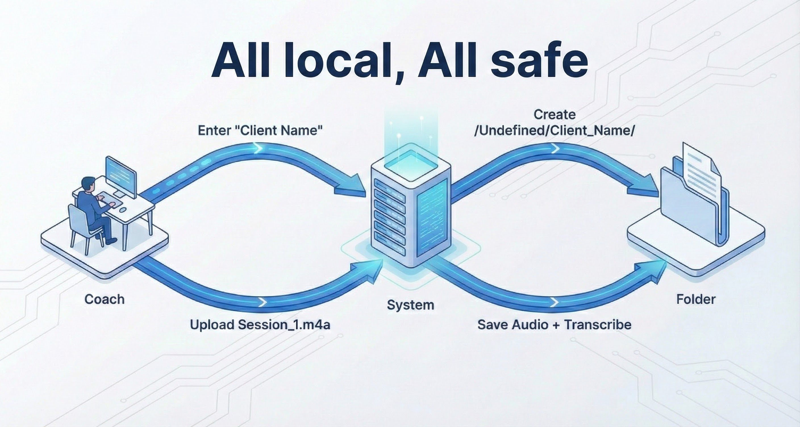
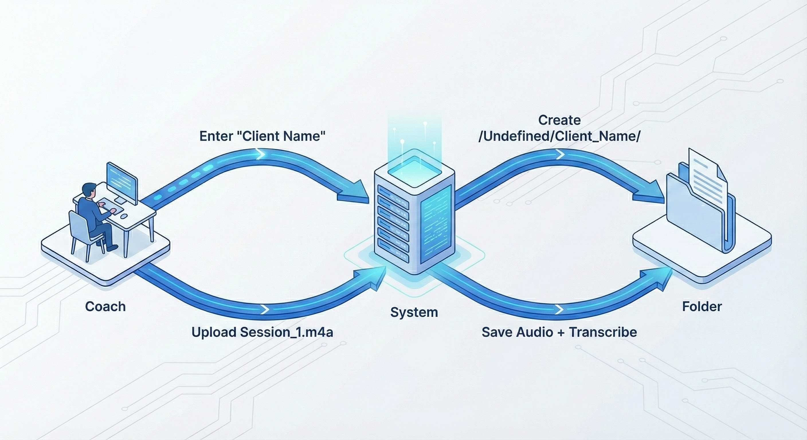
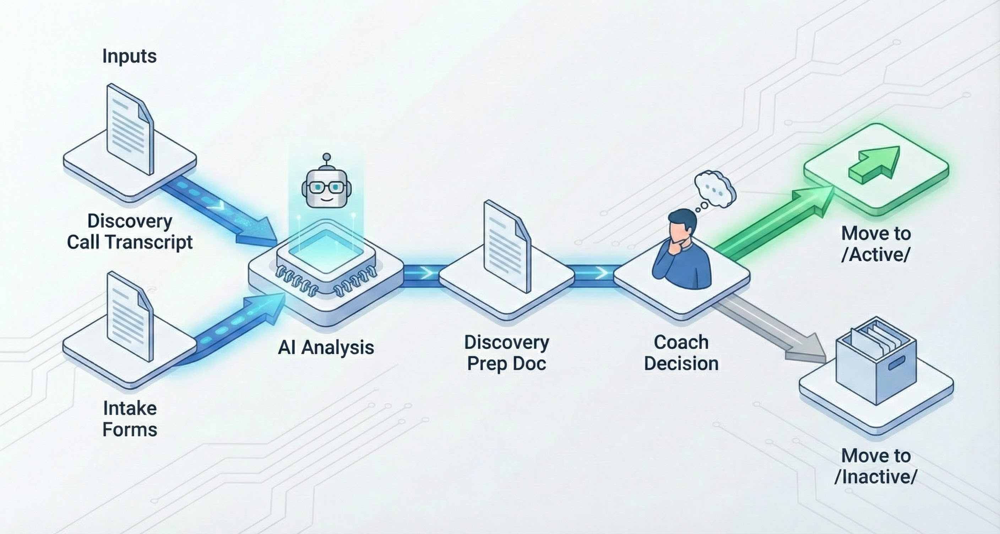
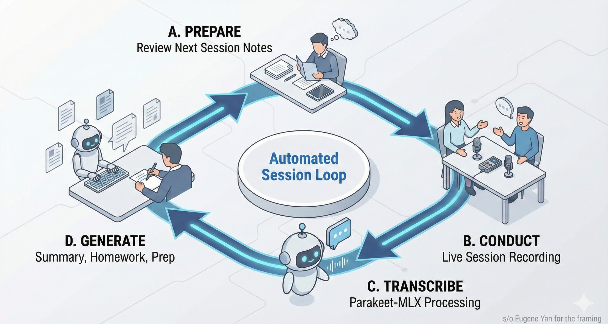

# LifeCoach AI System

A local-first AI-powered assistant for life coaches to manage client sessions, transcribe audio recordings, and generate coaching documents — all with complete privacy.

## Overview

LifeCoach AI System streamlines the administrative side of life coaching by automating session documentation. Upload a session recording, get an accurate transcription, and let AI generate session summaries, homework assignments, and next session preparation — all stored locally on your machine.

## Key Features

- **Audio Transcription** — Transcribe session recordings using Parakeet-MLX, optimized for Apple Silicon with support for 25 languages
- **Speaker Identification** — Optional speaker diarization to identify different speakers in recordings (requires HuggingFace token)
- **AI Document Generation** — Automatically generate session summaries, homework assignments, and next session drafts
- **Client Management** — Organize clients through discovery, active coaching, and archival stages
- **Local-First Privacy** — All data stays on your machine. No cloud uploads, no third-party access
- **Multi-Language Support** — Automatic language detection for European languages including English and Spanish

---

## Client Lifecycle Flow

LifeCoach AI System guides clients through a structured coaching journey, capturing valuable data at every stage.



### 1. Client Entry

New clients enter the system through their first recorded interaction — typically a discovery call or intake session.



| What Happens | Value |
|--------------|-------|
| Coach enters new client name | Client folder created automatically |
| First session recording uploaded | Capture the client's voice, goals, and context |
| AI transcribes the audio | Searchable, reviewable session record |

**Data Created:** `Undefined/Client_Name/Session_1/` with audio + transcription

---

### 2. Discovery Phase

Evaluate fit and understand client needs before committing to a coaching relationship.



| What Happens | Value |
|--------------|-------|
| Review transcription from discovery call | Understand client's words, not just notes |
| Upload intake forms and surveys | Centralized client information |
| AI generates discovery prep document | Structured analysis of goals and challenges |
| Decision: Move to Active or Inactive | Clear client pipeline management |

**Data Created:** Discovery prep document with AI-analyzed insights

---

### 3. Automated Session Loop

The core coaching workflow that repeats for every session.



```
┌─────────────┐     ┌─────────────┐     ┌─────────────┐     ┌─────────────┐
│ A. PREPARE  │ --> │ B. CONDUCT  │ --> │C. TRANSCRIBE│ --> │ D. GENERATE │
│             │     │   SESSION   │     │             │     │  DOCUMENTS  │
│ Review last │     │             │     │ Upload audio│     │ Summary     │
│ session's   │     │ Live        │     │ AI creates  │     │ Homework    │
│ next_session│     │ coaching    │     │ transcription     │ Next prep   │
│ .txt        │     │             │     │             │     │             │
└─────────────┘     └─────────────┘     └─────────────┘     └─────────────┘
                                                                    │
                                                                    v
                                                            ┌─────────────┐
                                                            │   REPEAT    │
                                                            └─────────────┘
```

| Step | What Happens | Value |
|------|--------------|-------|
| **A. Prepare** | Review AI-generated next session prep | Never forget follow-ups or commitments |
| **B. Conduct** | Live coaching session (recorded) | Focus on coaching, not note-taking |
| **C. Transcribe** | Upload recording, AI transcribes | Accurate, complete session record |
| **D. Generate** | AI creates summary, homework, next prep | Consistent documentation, saves hours |

**Data Created Per Session:**
- `audio_{filename}.m4a` — Original recording
- `transcription.txt` — Full session transcript
- `summary.txt` — Key takeaways and progress
- `homework.txt` — Client action items
- `next_session.txt` — Preparation for next session

---

### 4. Conversation Agent

As sessions accumulate, query across all client data for strategic insights.


| Sessions | Data Depth | Example Queries |
|----------|------------|-----------------|
| 1-3 | Basic info | "What are Maria's initial goals?" |
| 5-10 | Patterns emerge | "What challenges does Maria mention repeatedly?" |
| 10-20 | Growth visible | "How has Maria's confidence changed over time?" |
| 20+ | Deep understanding | "Compare Maria's progress to her original goals" |

**Value:** Transform session data into coaching intelligence. See patterns, track growth, maintain accountability.

---

## Tech Stack

| Component | Technology |
|-----------|------------|
| UI Framework | Streamlit |
| AI Agent Framework | LangChain / LangGraph |
| LLM Provider | Anthropic, OpenAI, or Ollama |
| Audio Transcription | Parakeet-MLX (Apple Silicon) |
| Speaker Diarization | Pyannote (optional) |
| Package Management | uv |

## Installation

### Prerequisites

- Python 3.12+
- macOS with Apple Silicon (M1/M2/M3) for optimal transcription performance
- [Homebrew](https://brew.sh/) for system dependencies

### Setup

```bash
# Clone the repository
git clone https://github.com/yourusername/LifeCoach_AI_System.git
cd LifeCoach_AI_System

# Install Python dependencies
uv sync

# Install FFmpeg (required for audio processing)
brew install ffmpeg

# Set up environment variables
cp .env.example .env
# Add your LLM API key (Anthropic, OpenAI, or Ollama endpoint)
```

### Running the Application

```bash
streamlit run app.py
```

## Usage

### Tab 1: Transcribe Audio

1. Select client type (Undefined or Active)
2. Choose existing client or enter new client name
3. Select session date
4. (Optional) Enable "Identify Speakers" for speaker diarization
5. Upload audio file (MP3, WAV, M4A, FLAC)
6. Click **Transcribe** — progress bar shows transcription status
7. Audio and transcription automatically saved to session folder

### Tab 2: Undefined Clients

Manage new client discovery. Upload intake forms, surveys, or notes. Move clients to Active when ready to begin coaching.

### Tab 3: Active Clients

Select a client and session to generate AI-powered documents:
- **Session Summary** — Key takeaways and progress notes
- **Homework** — Actionable assignments for the client
- **Next Session Prep** — Preparation notes for upcoming sessions

### Tab 4: Chat Assistant

Query client history, progress, and coaching notes across all sessions.

## Project Structure

```
LifeCoach_AI_System/
├── app.py                  # Streamlit application (4 tabs)
├── agents/                 # LangChain agent definitions
├── functions/              # Tools and helper functions
│   ├── agent_tools.py      # Agent tools for document generation
│   └── transcription.py    # Audio transcription (Parakeet-MLX)
├── config/                 # Configuration and path constants
└── LifeCoach_Data/         # Local data storage
    ├── Active/             # Active client sessions
    ├── Inactive/           # Archived clients
    ├── Undefined/          # New clients pending discovery
    └── Templates/          # Document templates
```

## Session Folder Structure

Each session creates a folder with the format `Session_{N}_{DD-MM-YYYY}`:

```
LifeCoach_Data/Active/Client_Name/Session_1_10-12-2025/
├── audio_recording.m4a     # Original audio file
├── transcription.txt       # AI-generated transcription
├── summary.txt             # Session summary
├── homework.txt            # Client homework
└── next_session.txt        # Next session preparation
```

## Requirements

- **LLM API Key** — Your preferred LLM provider (Anthropic, OpenAI, or local via Ollama)
- **FFmpeg** — For audio file processing (`brew install ffmpeg`)
- **Apple Silicon Mac** — Recommended for optimal Parakeet-MLX performance

## Privacy

This application is designed with privacy as a core principle:

- All audio files and transcriptions remain on your local machine
- No data is sent to external servers (except LLM API calls for document generation)
- Client information never leaves your control

## License

MIT License

## Acknowledgments

- [Parakeet-MLX](https://github.com/senstella/parakeet-mlx) — Fast audio transcription for Apple Silicon
- [Pyannote](https://github.com/pyannote/pyannote-audio) — Speaker diarization
- [Streamlit](https://streamlit.io/) — Python web application framework
- [LangChain](https://langchain.com/) — AI agent framework
